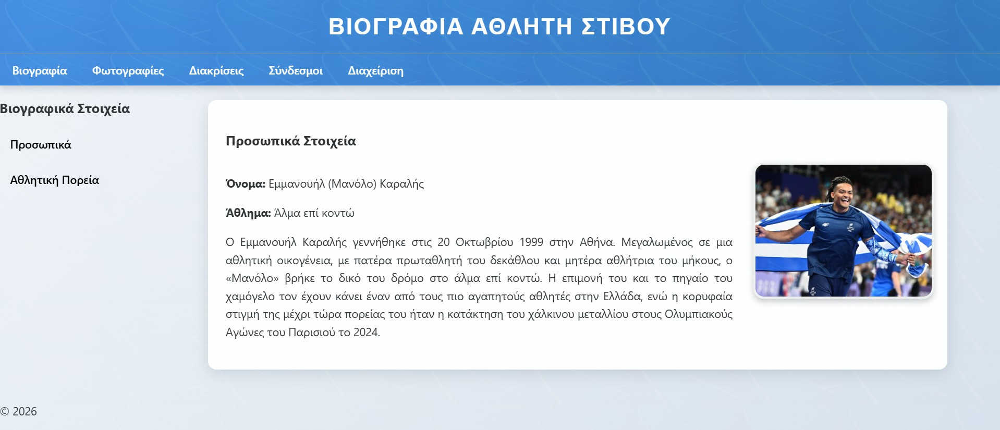
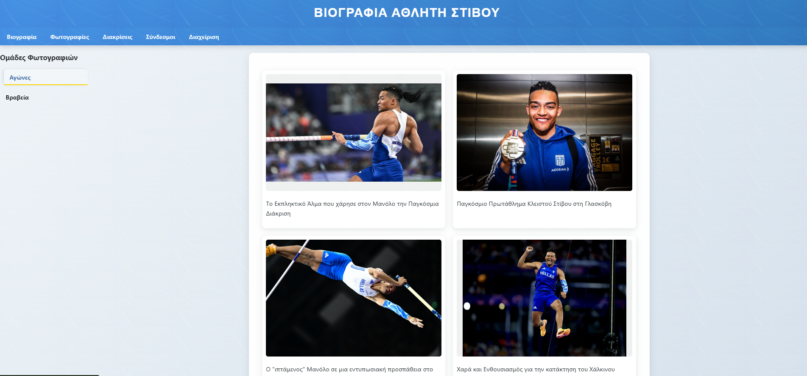
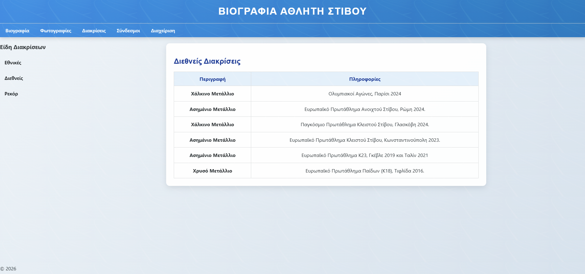

# 🏃‍♂️ Karalis Biography SPA

> **A Single Page Application showcasing the biography of Emmanouil Karalis, Olympic pole vaulter.**

[](https://opensource.org/licenses/MIT)
[](https://nodejs.org/)
[](https://expressjs.com/)

---

## Live Demo

[](https://karalis-biography-spa.vercel.app/#)

---

## About This Project

This project started as a **school assignment** for the **Web Development** course, with the goal of learning the fundamentals of full-stack development: HTML/CSS/JavaScript, Node.js/Express, REST APIs, JWT authentication, and deployment.

After completing the course, I significantly refined and improved it to become a **professional portfolio project** that demonstrates my skills as a developer.

### 🎯 Learning Objectives Covered
- ✅ Single Page Application (SPA) architecture with vanilla JS
- ✅ RESTful API design with Express.js
- ✅ JWT-based authentication & authorization
- ✅ File-based data persistence (JSON)
- ✅ Responsive design & modern CSS
- ✅ Deployment to Vercel (frontend + serverless functions)

---

## Features

| Category | Details |
|----------|---------|
| **Biography** | Complete bio, career highlights, statistics |
| **Photos** | Organized albums by category (competitions, training, etc.) |
| **Distinctions** | Olympic, World, European medals & records |
| **Links** | Interviews, videos, social media |
| **Admin Panel** | JWT-protected for adding/editing content |

---

## Tech Stack

### Frontend
- **Vanilla JavaScript (ES6+)** — SPA routing, dynamic content loading
- **CSS3** — Custom properties, Flexbox/Grid, responsive design
- **Semantic HTML5** — Accessibility-first markup

### Backend
- **Node.js** + **Express 5** — REST API server
- **JWT (jsonwebtoken)** — Stateless authentication
- **File System (fs)** — JSON-based data storage
- **dotenv** — Environment configuration

### Deployment
- **Vercel** — Frontend hosting + Serverless Functions
- **GitHub** — Version control & CI/CD

---

## 📁 Project Structure

```
karalis-biography-spa/
├── public/                 # Frontend (served statically)
│   ├── index.html         # Main SPA entry point
│   ├── css/
│   │   └── style.css      # All styles
│   ├── js/
│   │   ├── main.js        # SPA logic, navigation, API calls
│   │   └── admin.js       # Admin panel functionality
│   └── images/            # Athlete photos, assets
├── server/
│   ├── server.js          # Express server + API routes
│   └── data/
│       ├── distinctions.json  # Awards, medals, records
│       └── links.json         # Interviews, videos, social links
├── vercel.json            # Vercel deployment config
├── package.json
└── README.md
```

---

## Local Installation

### Prerequisites
- Node.js 18+
- npm or yarn

### Steps

```bash
# 1. Clone the repository
git clone https://github.com/DimitrisFournarakos/Manolo-Karalis-Biography-Website.git
cd Manolo-Karalis-Biography-Website

# 2. Install dependencies
npm install

# 3. Create .env file
cp .env.example .env
# Fill in SECRET_KEY (random string for JWT signing)

# 4. Start development server
npm run dev
# or
node server/server.js
```

The app will run at `http://localhost:3000`

### Environment Variables

| Variable | Description | Required |
|----------|-------------|----------|
| `SECRET_KEY` | Secret key for signing JWT tokens | ✅ Yes |
| `PORT` | Server port (default: 3000) | ❌ No |

---

## Admin Panel

The project includes a protected admin panel for content management:

- **URL:** `/admin.html` (or via button in UI)
- **Credentials:** `admin` / `123` (change in `server.js` for production)
- **Capabilities:** Add distinctions, links, photos

> **Important:** In production, change credentials and use a strong `SECRET_KEY`.

---

## API Endpoints

### Public Endpoints
| Method | Endpoint | Description |
|--------|----------|-------------|
| `GET` | `/api/links/:category` | Get links (interviews, video, web_links) |
| `GET` | `/api/distinctions/:category` | Get distinctions (national, international, records) |

### Protected Endpoints (Require JWT)
| Method | Endpoint | Description |
|--------|----------|-------------|
| `POST` | `/api/login` | Authentication, returns JWT token |
| `POST` | `/api/add/:type` | Add data (links/distinctions) |

---

## Screenshots

 
 

.png)
.png)

---

## Contributing

Since this is a personal portfolio project, PRs are welcome for:
- Bug fixes
- Accessibility improvements
- Performance optimizations
- Code quality / refactoring

```bash
# 1. Fork the repo
# 2. Create branch: git checkout -b feature/amazing-feature
# 3. Commit: git commit -m 'Add amazing feature'
# 4. Push: git push origin feature/amazing-feature
# 5. Open Pull Request
```

---

## License

Distributed under the **MIT License**. See `LICENSE` for more information.

---

## Author

**Dimitris Fournarakos**
- GitHub: [@DimitrisFournarakos](https://github.com/DimitrisFournarakos)
- Email: dfournarakos567@gmail.com

---

## Acknowledgments

- **Emmanouil Karalis** — For the inspiration and incredible athletic achievements
- **School/University** — For the opportunity to learn through this project
- **Open Source Community** — For the tools that made this project possible

---

> **If you liked this project, give it a star on GitHub!**  
> It's a small gesture that helps a lot with visibility.
